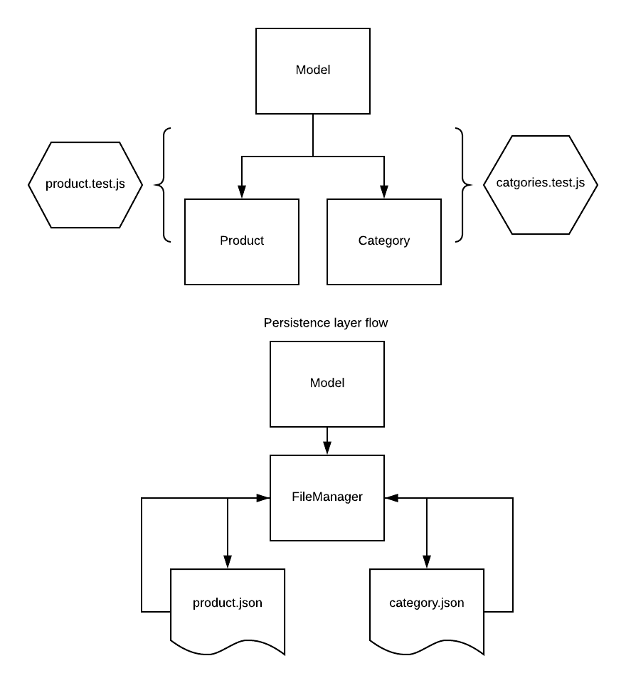

# LAB - 04

## Data Modeling

### Author: David Vloedman

### Links and Resources
* [submission PR](https://github.com/david-vloedman-401-advanced-javascript/401-lab-04/pull/1)
* [travis](https://www.travis-ci.com/david-vloedman-401-advanced-javascript/401-lab-04)

#### Documentation

* [JSDoc Index](./docs/index.html)

### Setup

npm install

  
#### Tests

npm test

#### UML

